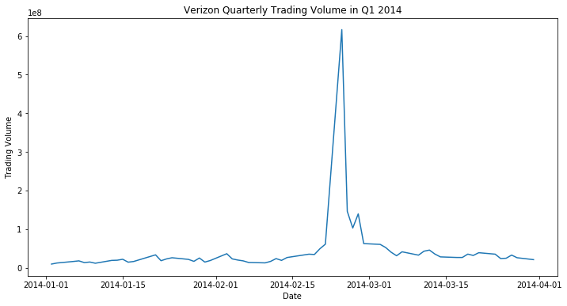
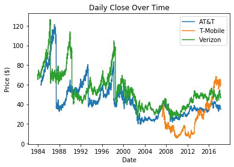
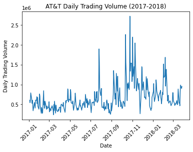
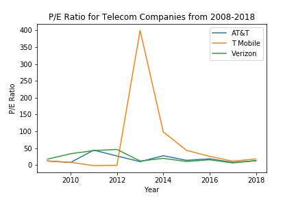
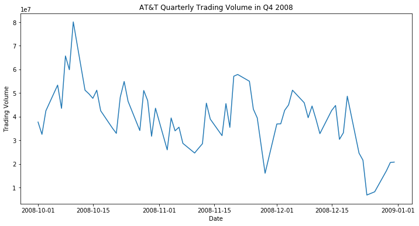
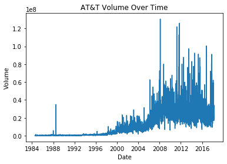
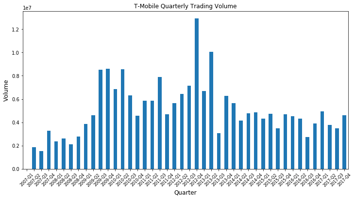
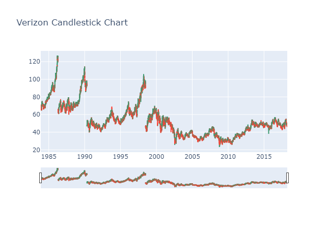

# Project1_Group1

## Contributions 
Generally speaking, each member worked equal parts on the code,  the analysis of the data, and the powerpoint presentation. 
|Member|Contribution|
|------|------------|
|Seth  | Intro, slides 1 & 2, volume & price|
|Andrew| slides 3 & 4, `README.md`, average trading volume, price|
|Madi| slides 5 & 6, data cleanup, dividend yield|
|Josh| slides 7 & 8, API, seasonal analysis|

## Objective
Our goal was to analyze the stock data of three telecommunications companies--AT&T, T-Mobile, and Verizon--and determine which company a potential investor should invest in. 

Overall, we determined that AT&T is the best option because it's less volatile and because of it's liquidity and consistent dividend payments, but it would be wise to view each company's financial reports before making a final decision. 

## Obtaining the data

We obtained our data from the [NASDAQ website](https://www.nasdaq.com/) using the API. <!-- on their [Developer Platform](https://developer.nasdaq.com/). -->

## 1. How much did the stock volume fluctuate for each company?

Volume is the number of shares transactions between the open and close on a daily basis.

Looking at volume over the lifetime of a company is beneficial because it provides us insight into the growth and health of the business.

**Analysis**: Verizon has a massive spike in 2014 in its daily volume. 

### Looking into the volume outlier of Verizon in 2014.

Verizon Q1 Analysis
It appears the outlier is specifically at the end of February beginning of March. According to research, Verizon acquired Vodafone at this time. It used proceeds from capital market transactions that it acquired in Sept 2013 and February 2014 as well as $6.6 billion borrowed February, 21 2014. This could account for such a peak in it's stock volume at this time, and for the sake of analyzing for investment purposes, this is not a notable piece of information. 

## 2. How did Price change over each companies lifetime?

The price of stock is the price of a single share. It is determined by calculating the company market capital divided by the number of shares

**Analysis**: T-Mobile’s data is limited to 2007-2018. Therefore, it is best to focus on the last 10 years of the data

**Analysis**: T-Mobile's price change fluctuations are severe. We are looking for a more linear or consistent positive percentage change - this indicates the stock price is increasing or staying at a competitive price in relation to industry.

## 3. How did stock volume change in the most recent years?

Daily trading volume allows us to see the number of shares of a stock that are traded in a given day. This helps us assess the liquidity of the market for that stock. High trading volume is usually good. 

<!-- 

 -->

**Analysis**: ATT is more liquid than the others. Investors can sell and buy these shares easier than the other two companies for this reason.

## 4. How did Stock Price change in the most recent years? 

<!--  -->

**Analysis**: Even zoomed in on the last year we see that T-Mobile has more fluctuations, ATT and Verizon are less volatile indicating they are more stable and better investment choices with the given data

## 5. Which company provides the higher and most consistent dividends for our investor?

<!-- 

 -->

**Analysis**: AT&T and Verizon make consistent dividend payments, which is important for an investor seeking to get a steady income from their investments. 

T-Mobile on the other hand only paid their dividends in 2013 in one big lump sum. This could mean that T-Mobile usually reinvests its profits into the business or that it had a significantly profitably year in 2013 and decided to pay a high dividends payment. 

Looking at this alone would not give us much insight into the companies financial state however. It is important to look at the financial reports to get a better idea of how each company is doing. 

## 6. How does the time of year affect the stock value? Are there seasonal trends? 

<!-- 

 -->

The data show us there there are no quarters that show significant peaks or that lead an investor to make short term investment decisions. The fluctuations in price don't seem to be related to the time of year.
 
- AT&T Quarter 2 seems to have the highest rate throughout the years. It is the only quarter that shows fewer fluctuations.

  
- T-Mobile shows less fluctuations in Quarter 1 but its percent change is severe.

- Verizon has no obvious pattern from these graphs.

## 7. What is the correlation between price and volume for each company

AT&T: as price increases volume increases there is a moderately strong negative correlation here.

T-Mobile has a very weak correlation between volume and price

Verizon also has a weak correlation with several outliers. 

## 8. What is the P/E Ratio for each company in the latest years of data? 

Decrease in earnings: If it's not the price, then maybe AT&T and Verizon have a decrease in EPS while the prices of stock were the same. And it does appear that in those years, the EPS were decreasing as the price remained the same or slightly increased.

<!-- 

 -->