# Project1_Group1

## 1. How much did the stock volume fluctuate for each company?

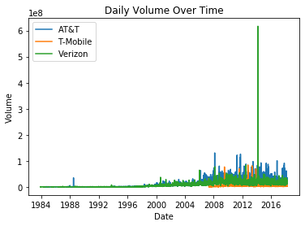

_Analysis_: Verizon has a massive spike in 2014 in its daily volume. 

## 2. How did Price change over each companies lifetime?

_Analysis_: T-Mobile’s data is limited to 2007-2018. Therefore, it is best to focus on the last 10 years of the data

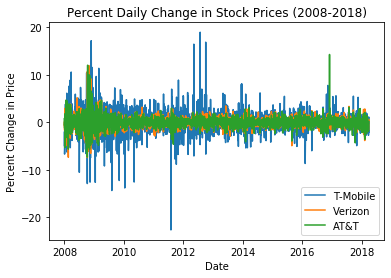

_Analysis_: T Mobile's price change fluctuations are severe. We are looking for a more linear or consistent positive percentage change - this indicates the stock price is increasing or staying at a competitive price in relation to industry.

## 3. How did stock volume change in the most recent years?

<!-- 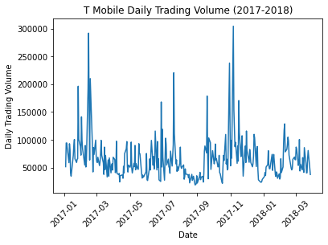

 -->

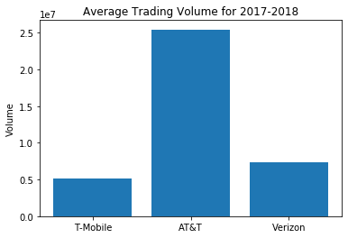

_Analysis_: ATT is more liquid than the others. Investors can sell and buy these shares easier than the other two companies for this reason.

## 4. How did Stock Price change in the most recent years? 

<!-- 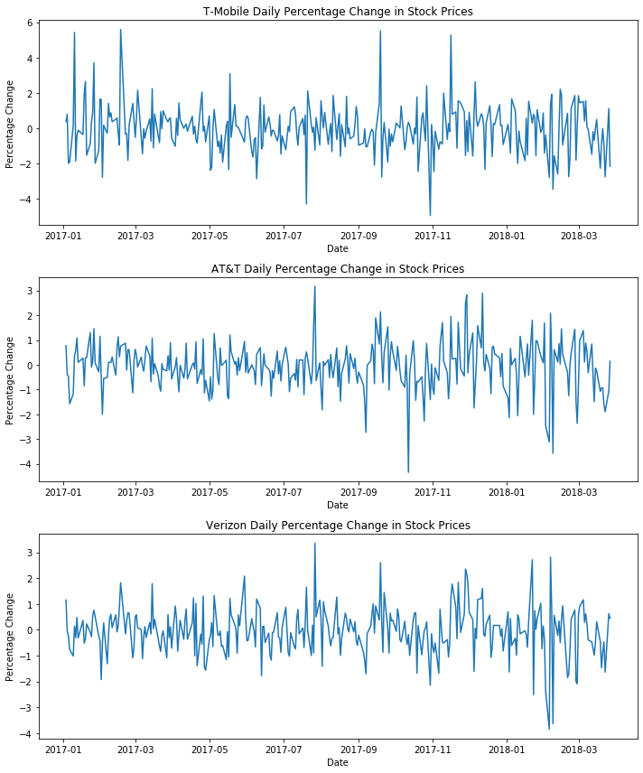 -->

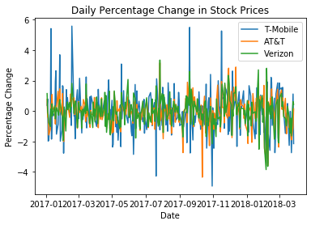

Analysis: Even zoomed in on the last year we see that T Mobile has more fluctuations, ATT and Verizon are less volatile indicating they are more stable and better investment choices with the given data

## 5. Which company provides the higher and most consistent dividends for our investor?

<!-- 

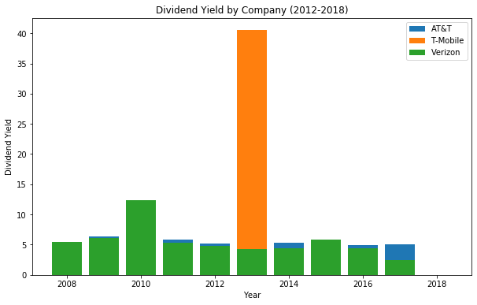 -->

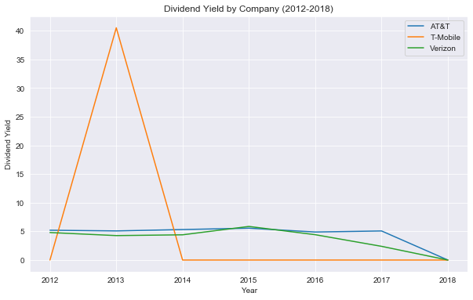

_Analysis_: AT&T and Verizon make consistent dividend payments, which is important for an investor seeking to get a steady income from their investments. 

T-Mobile on the other hand only paid their dividends in 2013 in one big lump sum. This could mean that T-Mobile usually reinvests its profits into the business or that it had a significantly profitably year in 2013 and decided to pay a high dividends payment. 

Looking at this alone would not give us much insight into the companies financial state however. It is important to look at the financial reports to get a better idea of how each company is doing. 

## 6. How does the time of year affect the stock value? Are there seasonal trends? 

<!-- 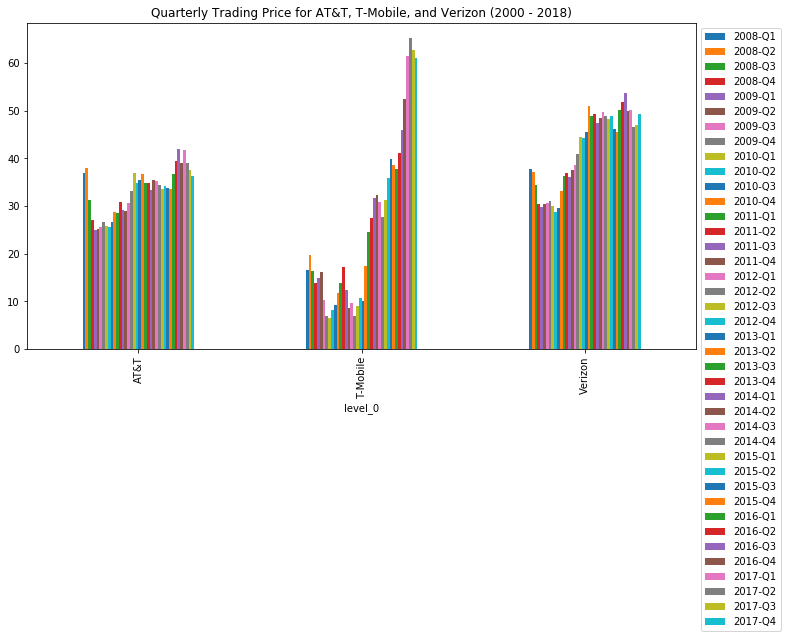

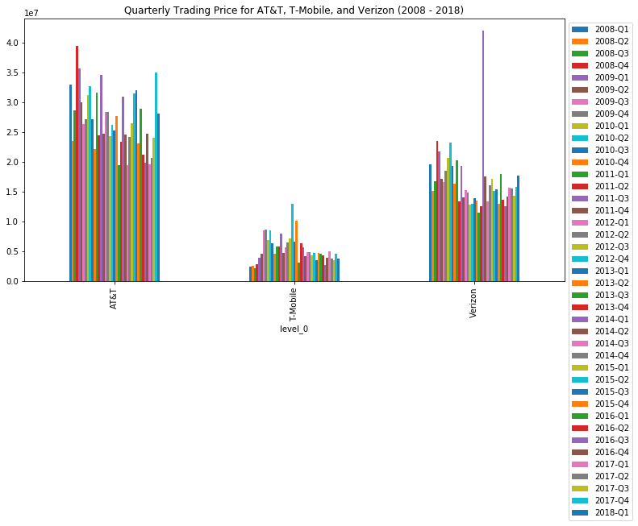 -->

The data show us there there are no quarters that show significant peaks or that lead an investor to make short term investment decisions. The fluctuations in price don't seem to be related to the time of year.
 
- AT&T Quarter 2 seems to have the highest rate throughout the years. It is the only quarter that shows fewer fluctuations.

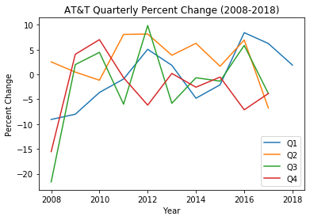
  
- T Mobile shows less fluctuations in Quarter 1 but its percent change is severe.

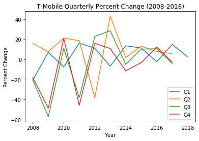

- Verizon has no obvious pattern from these graphs.

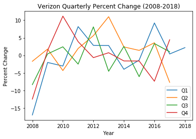

## 7. What is the correlation between price and volume for each company

AT&T: as price increases volume increases there is a moderately strong negative correlation here.

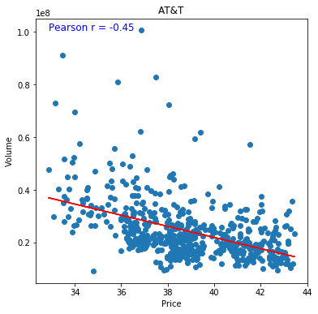

T-Mobile has a very weak correlation between volume and price

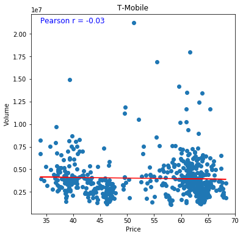

Verizon also has a weak correlation with several outliers. 

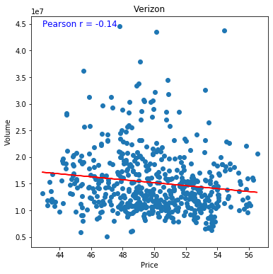

<!-- 

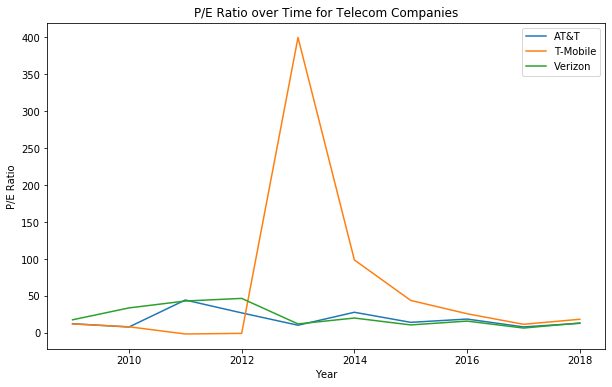

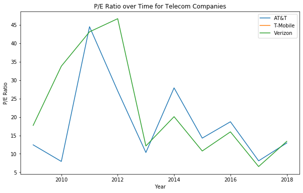

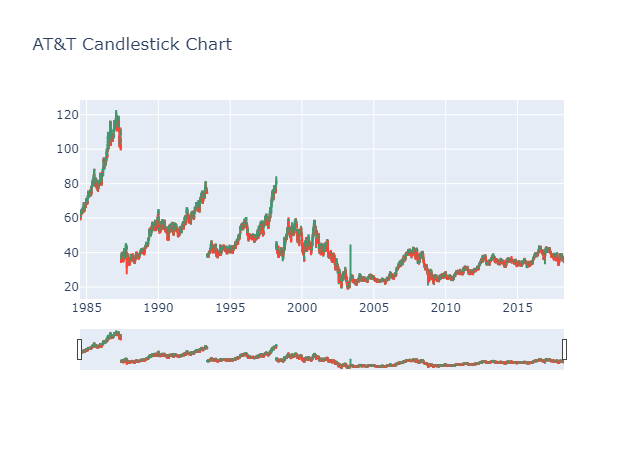

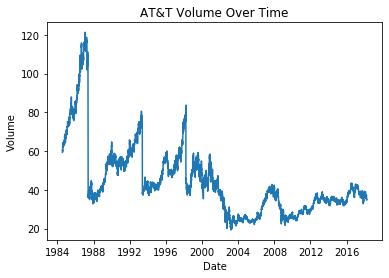

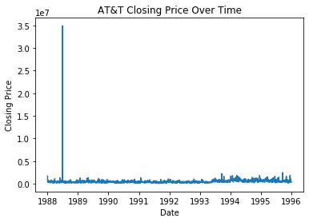

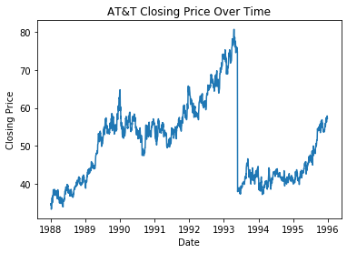

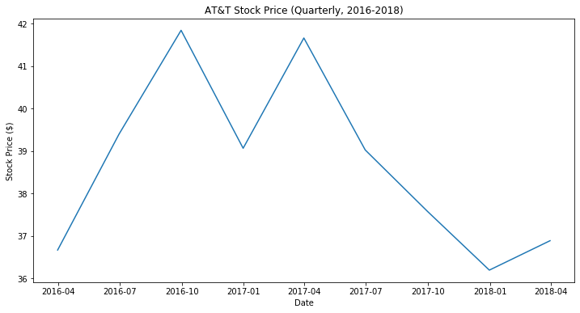

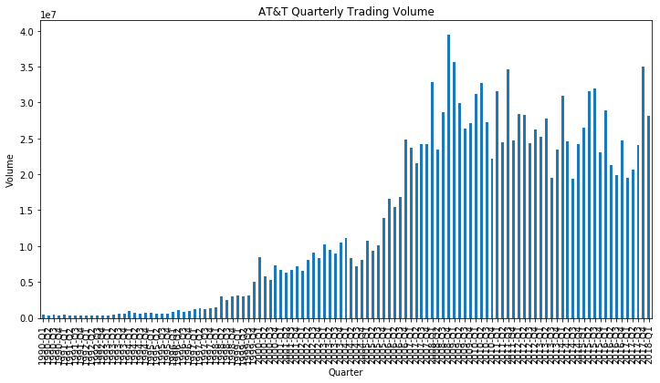

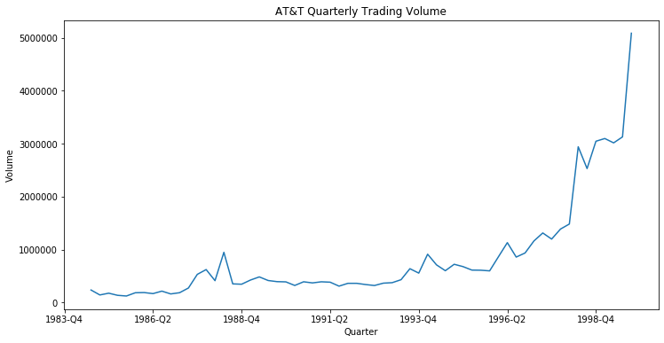

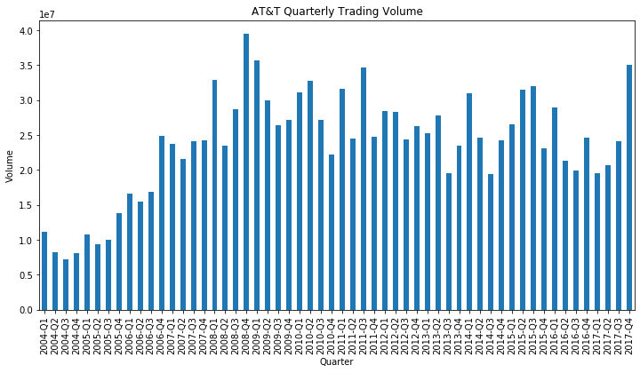

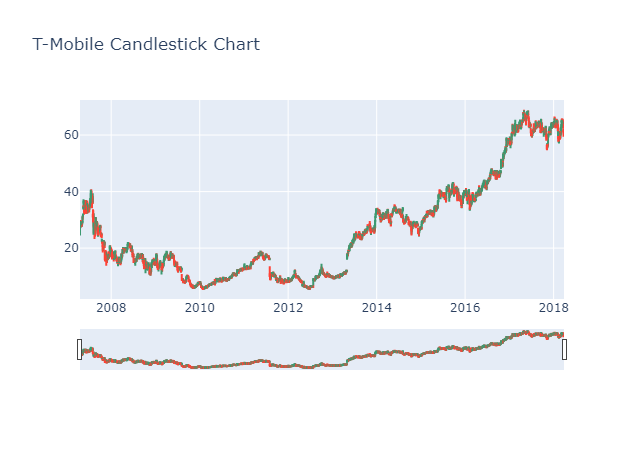

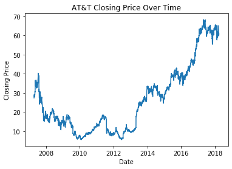

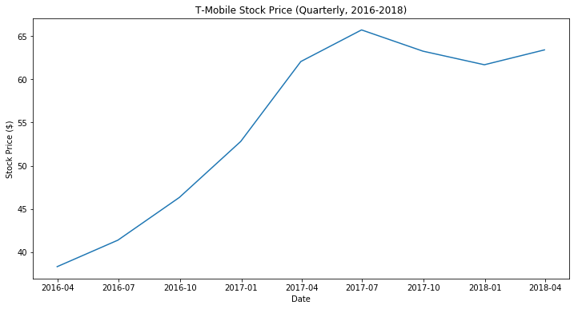

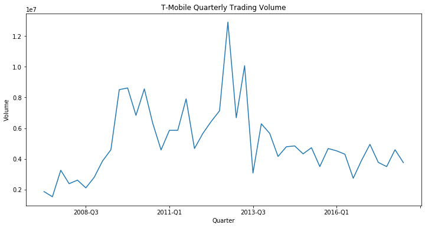

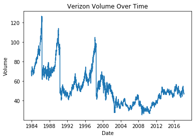

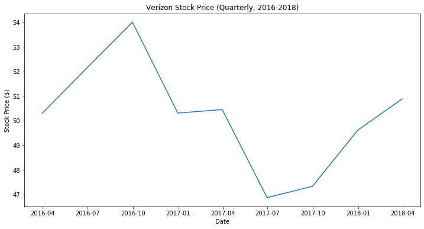

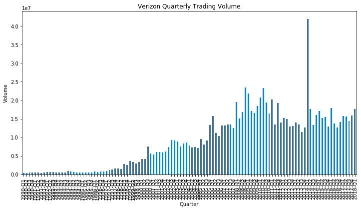

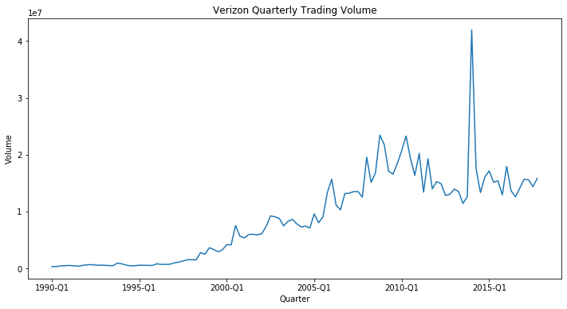 -->